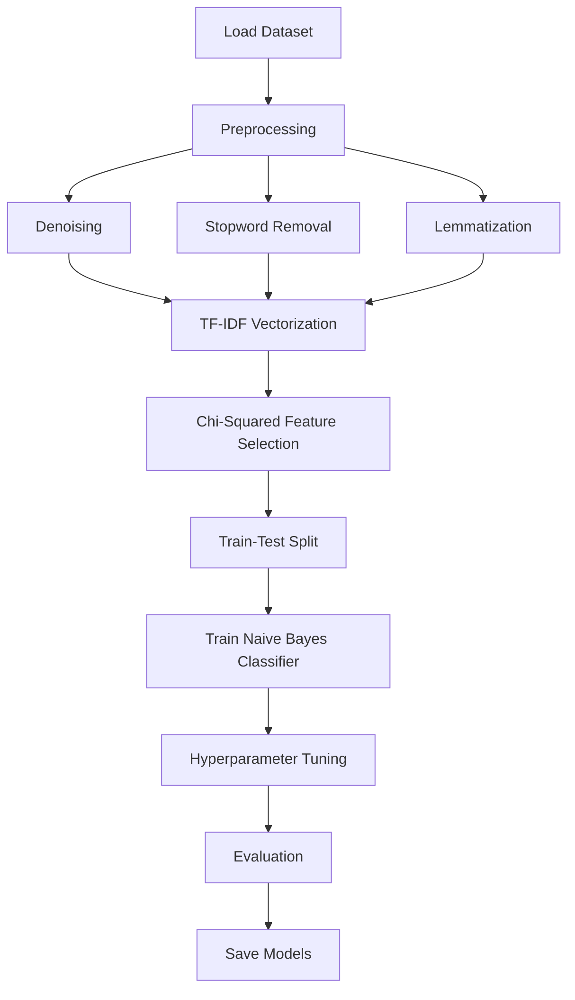

# Anonalyze Process – Sentiment and Emotion Classification

## Overview
This project develops a **sentiment and emotion classification model** using **Machine Learning (ML)** and **Natural Language Processing (NLP)**. The system analyzes text and predicts:
- **Sentiment**: positive, negative, or neutral
- **Emotion**: sadness, joy, love, anger, fear, or surprise

The core model utilizes a **Multinomial Naive Bayes classifier**, trained on a large dataset of Twitter messages.

## Previews
- **Model Training Process**: [See Live](https://htmlpreview.github.io/?https://github.com/hyoaru/anonalyze-process/blob/master/models/sentiment-emotion-classification/model-training-process.html)
- **Model Implementation Testing**: [See Live](https://htmlpreview.github.io/?https://github.com/hyoaru/anonalyze-process/blob/master/process.html)

## Anonalyze
This project is part of a larger initiative called [**Anonalyze**](https://github.com/hyoaru/anonalyze), which leverages AI and NLP to predict sentiment, extract key insights, and summarize user responses. It incorporates a Multinomial Naive Bayes classifier for emotion analysis, with a backend built using Flask, PHP Laravel, and Docker, and a frontend developed with React.

## Dataset
- **Source**: https://www.kaggle.com/datasets/nelgiriyewithana/emotions
- **Size**: 416,809 labeled tweets
- **Fields**:
  - `text`: The tweet content
  - `label`: Emotion category: [sadness, joy, love, anger, fear, surprise]

## Preprocessing Pipeline
To ensure clean and meaningful text features, the following preprocessing steps are applied:
1. **Denoising**: Remove usernames, links, and non-alphabetical characters.
2. **Stopword Removal**: Filter out common but uninformative words.
3. **Lemmatization**: Reduce words to their root/base form.

## Feature Engineering
- **TF-IDF Vectorization**: Transforms text into numerical features based on word importance.
- **Chi-Squared Feature Selection**: Retains only the most statistically significant features.

## Model Training
- **Algorithm**: Multinomial Naive Bayes
- **Optimization**: Grid Search + Cross-Validation to tune hyperparameters.

## Evaluation
Model performance is measured using:
- **Classification Reports**: Precision, recall, and F1-score.
- **Confusion Matrices**: Visualizes misclassifications.

## Output & Persistence
- Trained models, vectorizers, and feature selectors are **serialized and stored locally**.
- These saved components can be reloaded for inference without retraining.

## Model Pipeline

## Usage
To run the model, ensure all dependencies are installed and execute the Jupyter notebook `model-training-process.ipynb`.

## Acknowledgments
Nidula Elgiriyewithana. (2024). Emotions [Data set]. Kaggle. https://doi.org/10.34740/KAGGLE/DSV/7563141